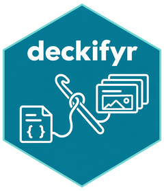
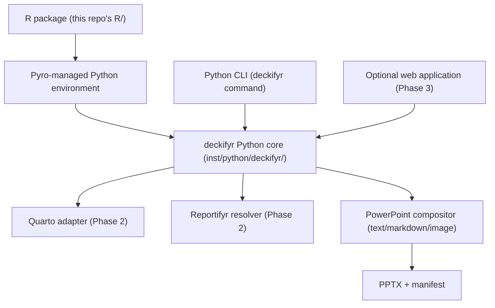

# deckifyr 

[](https://github.com/jprybylski/deckifyr/actions/workflows/ci.yml)
[](https://codecov.io/gh/jprybylski/deckifyr)

A declarative, code-first presentation compiler for
[Quarto](https://quarto.org) content and
[reportifyr](https://github.com/A2-ai/reportifyr) artifacts: `.pptx`
decks generated from version-controlled YAML, not a hand-clicked
PowerPoint template. A sibling project to
[quartifyr](https://github.com/jprybylski/quartifyr) in the same `fyr`
ecosystem, inheriting its reproducible, YAML-driven philosophy while
targeting slides instead of documents.

> **Status: early, but `deckifyr build` is real.** Schema validation,
> unit parsing, deep-merge precedence, layout expansion, and PPTX
> composition all work end-to-end for `text`/`markdown`/`image`/
> `shape`/`group`/`table`/`reportifyr`/`quarto` elements -- see
> `examples/demo-deck/` for a working example (a `quarto` element needs
> the external `quarto` binary on `PATH` to build; every other type
> needs nothing beyond this repo's own Python dependencies). See
> `deckifyr-specification.md` at the repo root for the full design and
> phased delivery plan, and `CLAUDE.md` for exactly what's real today
> versus stubbed.

## Why

Hand-built PowerPoint templates don't scale across projects or orgs any
better than hand-built Word templates do: every new deck means someone
re-clicking through slide masters, and drift between decks is a matter
of when, not if. deckifyr's answer, in the same spirit as quartifyr:
generate the deck from code and YAML -- design tokens, logical layouts,
and slide content all as separate, validated schemas -- so a new org's
look is a YAML diff and a new deck is data, not manual PowerPoint
surgery.

## Architecture: one engine, two facades



The Python source under `inst/python/deckifyr/` is canonical: it's
bundled unmodified inside the R package and is also the source
directory for the standalone Python wheel. Schema validation, merging,
resolution, and PPTX composition all live there; the R package is a
thin orchestration facade over it via [`pyro`](https://github.com/A2-ai/pyro),
never a second implementation of the same logic.

## Components

| Path | What it is | Language |
| --- | --- | --- |
| `R/` | Thin facade (`deck_validate()`, `deck_build()`, ...) delegating to the bundled Python CLI via pyro | R |
| `inst/python/deckifyr/` | The canonical engine: schemas, unit/merge logic, CLI. Bundled into the R package and built as the standalone wheel from the same source | Python |
| `inst/examples/minimal-deck/` | A minimal valid `design.yaml`/`layouts.yaml`/`presentation.yaml` trio, used as `deckifyr init`'s template and as the test fixture for both languages | YAML |
| `examples/demo-deck/` | A richer, repo-only demo (see its README.md) -- a five-slide deck using a real `reportifyr`-produced figure and two real `quarto` fragments | YAML |
| `tests/` | `tests/python/` (pytest, unit-level plus an end-to-end build of `examples/demo-deck/`) and `tests/testthat/` (R, including end-to-end tests of the real R→pyro→Python bridge) | Python, R |

## Quick start

```bash
# Python CLI, directly
uv run deckifyr init my-deck
uv run deckifyr validate my-deck/presentation.yaml
uv run deckifyr build my-deck/presentation.yaml   # writes my-deck/build/my-deck.pptx
```

```r
# R, via pyro
initialize_deck_project("my-deck")
deck_validate("my-deck/presentation.yaml")
deck_build("my-deck/presentation.yaml")  # writes my-deck/build/my-deck.pptx
```

For a richer working example than `init`'s minimal scaffold, see
`examples/demo-deck/` (`uv run deckifyr build
examples/demo-deck/presentation.yaml`).

See `CONTRIBUTING.md` for development setup and running the test
suites.

## Design docs

`deckifyr-specification.md` at the repo root is the authoritative design
document: ecosystem position, schema reference, compilation model,
Reportifyr/Quarto integration plans, PowerPoint composition strategy,
security model, and the phased delivery plan (Phase 0 feasibility spike
through Phase 4 advanced features). Anything this README summarizes,
that document covers in full.
