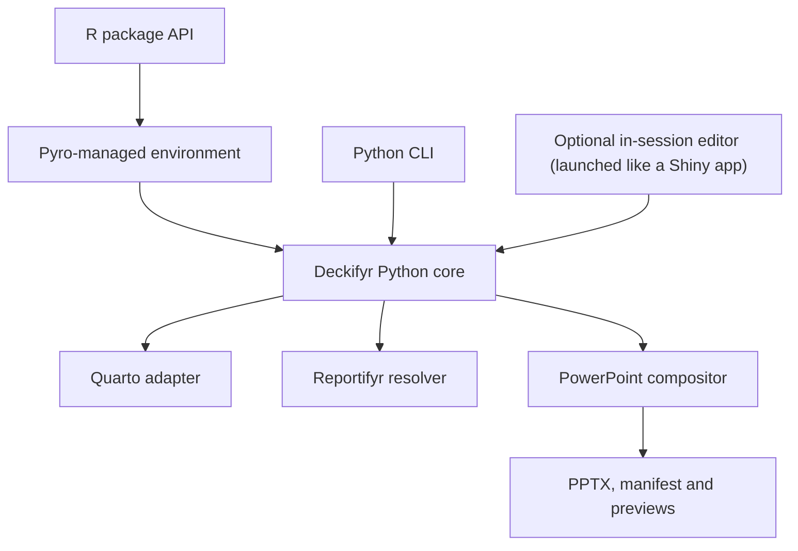

# Deckifyr: Design and Architecture Specification

**Status:** Draft proposal  
**Date:** 2026-08-13  
**Proposed repository:** `jprybylski/deckifyr`  
**Proposed license:** GPL-3.0-or-later  
**Primary product:** A declarative, code-first PowerPoint compiler  
**Primary interfaces:** A `pyro`-based R package and a Python CLI  
**Optional interface:** An in-session interactive editor, launched from within an existing RStudio/Positron R session (like a Shiny app), for manipulating and generating one project's configs — not a generic hosted website

## 1. Executive summary

Deckifyr should be a sibling project in the `fyr` ecosystem rather than a large presentation subsystem inside Quartifyr. It should inherit Quartifyr's reproducible, YAML-driven, shell/fill philosophy while maintaining an independent release cycle, dependency graph, test suite, and scope.

The recommended implementation is a **Python presentation engine with two first-class facades**:

1. An R package that uses [`pyro`](https://github.com/A2-ai/pyro) to provision a project-local Python environment and invoke the engine.
2. A Python package and CLI that invokes the same engine directly.

The Python source should be canonical and bundled inside the R package under `inst/python/`. The same source tree should also be buildable as a Python wheel. This avoids implementing slide generation twice and lets R and Python users produce equivalent outputs from the same YAML inputs.

The web application should be an optional, thin authoring and build interface over the CLI/core—not the owner of presentation logic. Its intended audience is a user who already has this R (or Python) package installed and a project open: they launch it from their RStudio/Positron session the way one launches a Shiny app, to interactively edit and generate that project's configs, not a general public visiting a hosted slide-building product ([issue #4](https://github.com/jprybylski/deckifyr/issues/4)).

> **Primary recommendation:** Build and stabilize the compiler and schemas before building the web editor.

## 2. Project identity and ecosystem position

### 2.1 Recommended name

**Deckifyr** is the recommended name because it:

- Fits the `reportifyr`, `presentifyr`, and `quartifyr` naming family.
- Communicates presentation-deck generation without binding the project forever to Microsoft PowerPoint.
- Clearly distinguishes the project from Presentifyr's interactive workflow.
- Works naturally as an R package name, Python distribution name, CLI command, and web application name.

Suggested description:

> **deckifyr** is a declarative, code-first presentation compiler for Quarto content and reportifyr artifacts.

### 2.2 Relationship to adjacent projects

| Project | Responsibility |
|---|---|
| Quartifyr | Code-first document shell and styling generation, currently focused on DOCX |
| Reportifyr | Report artifact insertion, metadata, footnotes, and document finalization |
| Presentifyr | Interactive presentation assembly, currently centered on selecting image artifacts |
| Deckifyr | Declarative presentation compilation with explicit geometry and reproducible builds |
| Pyro | Shared `uv`/Python environment management for R packages in the `fyr` ecosystem |

Deckifyr should support Reportifyr conventions and artifacts, but it should not call Reportifyr's DOCX-specific fill pipeline. Presentifyr and Deckifyr may coexist: Presentifyr remains useful for interactive/manual assembly, while Deckifyr targets version-controlled, declarative production.

## 3. Goals

Deckifyr should:

- Generate `.pptx` presentations from version-controlled YAML and content files.
- Separate design tokens, logical layouts, and presentation content into distinct schemas.
- Permit every slide to override or ignore its base layout.
- Support arbitrary element position, dimensions, rotation, crop, fit, and stacking order.
- Support Reportifyr `{rpfy}:` magic strings and metadata sidecars.
- Use Quarto for content execution and fragment rendering where it adds value.
- Preserve editable PowerPoint text and tables when practical.
- Offer deterministic validation and reproducible dependency management.
- Expose equivalent R and Python user experiences.
- Produce a build manifest containing dependency versions, input hashes, resolved artifacts, and warnings.
- Support slide previews without requiring preview generation to be the source of truth.
- Make an in-session interactive interface possible — launched from an active RStudio/Positron R session via `deck_serve()`, the same way a Shiny app is launched, against the one project already open in that session — without coupling the compiler to a web framework.

## 4. Non-goals for version 1

Version 1 should not promise:

- A publicly hosted, general-purpose, or multi-tenant web product for users without the R or Python package installed. The web interface is an in-IDE authoring tool for one local project at a time, not a destination site for arbitrary slide-building needs ([issue #4](https://github.com/jprybylski/deckifyr/issues/4)).
- A complete browser-based WYSIWYG PowerPoint replacement.
- Full fidelity for every PowerPoint feature, animation, transition, chart, SmartArt object, or embedded OLE object.
- Arbitrary creation and mutation of native PowerPoint slide masters through public `python-pptx` APIs.
- Perfect text pagination or line wrapping identical across PowerPoint, LibreOffice, macOS, and Windows.
- Importing an arbitrary existing presentation and losslessly converting it into Deckifyr YAML.
- Automatic compatibility with every Reportifyr table serialization format.
- Secure execution of untrusted Quarto, R, or Python code in a shared multi-tenant server without external isolation.
- Byte-for-byte identical `.pptx` ZIP archives across every platform.
- Drop-in behavioral compatibility with Presentifyr.

## 5. Recommended implementation model

### 5.1 One engine, two facades



The R layer should remain a thin orchestration facade. Validation, merging, resolution, placement, and PPTX manipulation should live in Python.

### 5.2 Why a Pyro-based R package is reasonable

Pyro already provides the required bridge:

- It records Python dependency groups in the user's `pyproject.toml`.
- It makes that project file and `uv.lock` the dependency source of truth.
- It creates and synchronizes a project-local `.venv/`.
- It exposes `run_python_script()` for invoking Python modules from R.
- It supports a `PYTHONPATH`, allowing an R package to execute bundled Python source.

Deckifyr can therefore use a pattern similar to:

```r
initialize_deck_project <- function() {
  pyro::write_group_to_pyproject(
    name = "deckifyr",
    deps = c(
      "python-pptx==<pin>",
      "pydantic==<pin>",
      "pyyaml==<pin>",
      "pillow==<pin>"
    )
  )
  pyro::initialize_python(groups = "deckifyr")
}
```

R calls should execute the bundled module using a package path:

```r
paths <- pyro::get_venv_uv_paths()
python_src <- system.file("python", package = "deckifyr")

pyro::run_python_script(
  uv_path = paths$uv,
  venv_path = paths$venv,
  args = c("run", "-m", "deckifyr", "build", "presentation.yaml"),
  script_name = "deckifyr",
  pythonpath = python_src
)
```

Pyro's current public API names this argument `pythonpath` and exports it to the subprocess as `PYTHONPATH`.

### 5.3 Python CLI distribution

The same `inst/python/deckifyr/` source should be configured as a Python package through `pyproject.toml`. This permits:

```bash
uv tool install deckifyr
deckifyr validate presentation.yaml
deckifyr build presentation.yaml
```

Recommended rule:

> The R package executes its bundled Python source; the standalone CLI executes the wheel built from that exact same source directory.

This avoids requiring the R package to install a second copy of Deckifyr into the virtual environment, while still supporting a normal Python installation.

### 5.4 Repository layout

```text
deckifyr/
├── DESCRIPTION
├── LICENSE
├── NAMESPACE
├── R/
│   ├── initialize.R
│   ├── build.R
│   ├── validate.R
│   ├── preview.R
│   └── serve.R
├── inst/
│   ├── python/
│   │   └── deckifyr/
│   │       ├── __init__.py
│   │       ├── __main__.py
│   │       ├── cli.py
│   │       ├── schema/
│   │       ├── renderers/
│   │       ├── resolvers/
│   │       ├── pptx/
│   │       └── web/
│   ├── schemas/
│   └── examples/
├── pyproject.toml
├── tests/
│   ├── testthat/
│   ├── python/
│   ├── fixtures/
│   └── golden/
└── vignettes/
```

The Python build configuration must point to `inst/python` as its package source directory. CI should verify that the R package and Python wheel both execute the same core test corpus.

## 6. Compilation model

Deckifyr should preserve Quartifyr's conceptual shell/fill split, adapted for slides.

### Pass 1: plan and shell

1. Load and validate schema versions.
2. Deep-merge base design and organization/project overrides.
3. Load logical layouts.
4. Expand each presentation slide into a normalized slide plan.
5. Create a shell containing base shapes and unresolved content references.

### Pass 2: resolve and compose

1. Resolve file paths and `{rpfy}:` references.
2. Execute or render Quarto fragments.
3. Insert native or rendered content.
4. Apply footnotes, provenance, alt text, and speaker notes.
5. Validate geometry, overflow, and required content.
6. Write the final PPTX, manifest, warnings, and optional previews.

Both passes may run within one `deckifyr build` command. They should remain separate internal stages so that a shell can be inspected, cached, or filled again when artifacts change.

## 7. Configuration model

### 7.1 Files

| File | Responsibility |
|---|---|
| `design.yaml` | Slide dimensions, typography, colors, spacing, defaults, table styles, shape styles, named tokens, and document furniture (background image, status marker, branding, page numbers — §7.8) |
| `layouts.yaml` | Reusable logical slide structures composed of named elements |
| `presentation.yaml` | Slide order, content references, geometry, overrides, notes, and build settings |

Each schema must contain an explicit Deckifyr schema version.

### 7.2 Merge precedence

The effective element should be calculated in this order:

```text
engine defaults
  < base design
  < organization design override
  < project design override
  < logical layout
  < slide-level override
  < element-level inline style
```

Dictionaries are recursively merged. Scalars and lists replace their parent value unless a field explicitly defines additive behavior.

### 7.3 Units and coordinates

- Coordinate origin: top-left of the slide.
- Positive `x`: right.
- Positive `y`: down.
- Positive rotation: clockwise.
- User-facing units: explicit strings such as `0.75in`, `18pt`, or `2.5cm`.
- Internal units: PowerPoint EMUs.
- Unitless geometry should be rejected in strict mode.
- Percent-based coordinates may be added later but should not be required for version 1.

Explicit units are more verbose but prevent ambiguity and make schema errors easier to diagnose.

### 7.4 Example `design.yaml`

```yaml
deckifyr: "0.1"

slide:
  width: 13.333in
  height: 7.5in
  background: "#FFFFFF"
  background_gradient:          # optional; paints over `background` as the slide's own fill
    stops:
      - {color: "#F7FBFF", position: 0.0}
      - {color: "#DEEBF7", position: 1.0}
    angle: 135                  # 0 = left-to-right, increasing = clockwise; 90 = top-to-bottom
  safe_area: 0.35in

fonts:
  body: Arial
  heading: Arial
  monospace: Consolas

colors:
  text: "#202124"
  muted: "#5F6368"
  primary: "#2457A6"
  accent: "#D14D32"

text_styles:
  title:
    font: heading
    size: 28pt
    bold: true
    color: primary
  body:
    font: body
    size: 16pt
    color: text
  footnote:
    font: body
    size: 8pt
    color: muted
  watermark:
    font: heading
    size: 96pt
    bold: true
    color: primary
    opacity: 0.28                # optional, 0.0-1.0; unset (the default) is fully opaque
    text_transform: uppercase    # optional; none (default) / uppercase / lowercase / capitalize

defaults:
  overflow: error
  image_fit: contain
  rotation: 0

shape_styles:
  callout-card:
    fill:                       # a shape_styles `fill` accepts either a plain color/token
      stops:                    # (as above) or, as here, a `Gradient` with 2+ stops
        - {color: primary, position: 0.0}
        - {color: "#FFFFFF", position: 1.0}
      angle: 90
```

A `Gradient` (either `slide.background_gradient` or a `shape_styles` entry's own `fill`) is a
list of 2+ `{color, position}` stops plus an `angle`; `color` may be a `colors:` token or a
literal hex value, the same "token or bare literal" convention every other color-bearing field
in `design.yaml` already uses.

A `text_styles` entry's `text_transform` (`none`/unset, `uppercase`, `lowercase`, or
`capitalize`) applies a case transform to that style's own rendered text at compose time — the
main use case is a status-indicator style (§7.8) turning `presentation.yaml`'s own free-text
`metadata.status`/`watermark` value ("demo") into the all-caps convention a status/watermark mark
conventionally uses ("DEMO") without requiring the author to type it that way.

### 7.5 Example `layouts.yaml`

```yaml
deckifyr: "0.1"

layouts:
  title-content:
    elements:
      title:
        type: text
        box: {x: 0.7in, y: 0.35in, width: 11.9in, height: 0.65in}
        style: title
        required: true
      content:
        type: slot
        box: {x: 0.7in, y: 1.25in, width: 11.9in, height: 5.35in}
      footnotes:
        type: footnotes
        box: {x: 0.7in, y: 6.72in, width: 11.9in, height: 0.45in}
        style: footnote

  blank:
    elements: {}
```

Layouts are logical Deckifyr constructs. They do not need to be native PowerPoint layouts.

### 7.6 Example `presentation.yaml`

```yaml
deckifyr: "0.1"
design:
  base: design.yaml
layouts: layouts.yaml

metadata:
  title: Exposure Summary
  author: Clinical Pharmacology
  status: draft

build:
  strict: true
  output: build/exposure-summary.pptx
  manifest: build/exposure-summary.manifest.json
  previews: true

# Optional (§7.8); selects one of design.yaml's furniture.status
# placements. Omitting status_indicator (or setting it to "none") shows
# no status marker at all.
status_indicator: watermark   # or corner-tr / corner-tl / corner-bl / corner-br / none
# The mark's own text is metadata.status above ("draft") by default --
# no separate watermark: field needed here. Set watermark: explicitly
# only when the mark's text should differ from metadata.status.

slides:
  - id: title
    layout: blank
    elements:
      - id: deck-title
        type: markdown
        value: "# Exposure Summary"
        box: {x: 0.9in, y: 2.1in, width: 11.5in, height: 1.1in}
        render_mode: native
        style: title

  - id: exposure-plot
    layout: title-content
    elements:
      title:
        value: Exposure by treatment
      content:
        type: reportifyr
        value: "{rpfy}:01-12345-pk-timecourse.png"
        box: {x: 0.8in, y: 1.3in, width: 7.4in, height: 4.9in}
        fit: contain
        alt_text: Concentration-time profiles by treatment group
      interpretation:
        type: quarto
        source: fragments/exposure-interpretation.qmd
        box: {x: 8.55in, y: 1.3in, width: 3.9in, height: 4.9in}
        render_mode: native
        overflow: shrink

  - id: freeform
    layout: null
    elements:
      - id: background-diagram
        type: image
        source: OUTPUTS/figures/model-diagram.svg
        box: {x: 0.35in, y: 0.25in, width: 12.6in, height: 6.9in}
        rotation: -2
        z_index: 0
```

### 7.7 Element model

Common element fields should include:

| Field | Meaning |
|---|---|
| `id` | Stable name for override, diagnostics, and synchronization |
| `type` | `text`, `markdown`, `quarto`, `image`, `table`, `shape`, `group`, `slot`, `footnotes`, or `reportifyr` |
| `value` / `source` | Inline content or content reference |
| `box` | `x`, `y`, `width`, and `height` |
| `rotation` | Clockwise degrees |
| `z_index` | Explicit stacking order |
| `style` | Named design style |
| `fit` | `contain`, `cover`, `stretch`, or `none` |
| `overflow` | `error`, `shrink`, `clip`, or `continue` |
| `render_mode` | `native`, `svg`, `png`, or `auto` |
| `alt_text` | Accessibility text |
| `remove` | Remove an inherited layout element |
| `required` | Fail validation if unresolved or empty |
| `center` | Center text both horizontally and vertically within `box` (`text`/`markdown` only; default `false`) |

Named elements are essential. Array indices should never be the primary override mechanism.

### 7.8 Document furniture

> **Status:** Implemented (`deckifyr.schema.design.Furniture` and
> `deckifyr.plan._furniture_layout`), closing
> [issue #1](https://github.com/jprybylski/deckifyr/issues/1).

Organization decks are typically identified by more than color tokens and typography: a
background image, a draft/final status marker, an organization or department label, and a
slide number are all conventionally part of the *design*, not something authors should have to
place by hand on every slide. These belong in `design.yaml` as a `furniture` block, sitting
alongside `slide:` in the merge precedence defined in §7.2, and expanding into reserved
elements the same way `layouts.yaml`'s `footnotes` zone does (§7.5) rather than as a new
compositor concept:

```yaml
slide:
  width: 13.333in
  height: 7.5in
  background: "#FFFFFF"
  background_image: null      # optional path/URI; renders behind all slide content
  safe_area: 0.35in

furniture:
  status:
    # Each field is one placement presentation.yaml's own status_indicator
    # (§7.6) may select -- nothing here is "the" status marker; a build
    # picks one (or none) and supplies its own text, so design.yaml only
    # configures the appearance a project actually intends to offer.
    watermark:
      box: {x: 0.5in, y: 2.5in, width: 12.3in, height: 2.5in}
      style: watermark            # a text_styles entry with its own `opacity` (§7.4)
      rotation: -30               # optional; angles status into a diagonal watermark
      z_index: 9999                # optional; paints on top of ordinary content instead of behind it
    corner_br:
      box: {x: 10.5in, y: 6.9in, width: 2.5in, height: 0.35in}
      style: footnote
  branding:
    text: "Acme Corp / Biostatistics"
    box: {x: 0.5in, y: 7.05in, width: 6in, height: 0.3in}
    style: footnote
  page_number:
    enabled: true
    format: "{page} / {total}"
    box: {x: 12.6in, y: 7.05in, width: 0.7in, height: 0.3in}
    style: footnote
```

Design notes:

- Furniture fields merge like any other `design.yaml` token (§7.2): an organization base can
  configure `furniture.status`'s placements and set `branding.text`, and a project override can
  redefine or drop any of them, without redefining the whole block.
- Each configured furniture item expands, once per slide, into a reserved element id
  (`__furniture_background`, `__furniture_status`, `__furniture_branding`,
  `__furniture_page_number`) merged into that slide's zones *ahead of* its named layout's own
  zones, using the exact same merge/override/`remove` machinery layout zones already use (§7.7)
  — so a slide overrides or removes a furniture item the same way it overrides or removes an
  inherited layout element, e.g. `elements: {__furniture_status: {remove: true}}`, for the rare
  slide (a title or section divider) that needs different placement or no furniture at all. The
  `__furniture_` prefix keeps these reserved ids out of the way of ordinary author-chosen zone
  and element ids.
- Furniture never obscures real content by default: `__furniture_background` composes at
  `z_index: -1000`, the other three at `z_index: -10`, both well below the `z_index: 0` every
  ordinary element defaults to. `status` is the one exception, and only when its selected
  placement's own `z_index` (unset by default) is explicitly set: a genuine diagonal watermark
  needs to read on top of whatever content it crosses (the conventional Word/Google Docs "DRAFT"
  look), not hide behind it — see the `style: watermark`/`opacity` note below for how it stays
  legible rather than fully obscuring what it crosses.
- `background_image` composes with `slide.background`; the color remains the fallback/letterbox
  behind a non-covering image. It gets a fixed alt text ("Background image") rather than an
  author-configurable one, since every image element requires alt text (§13) and a decorative
  background has no author-facing content to describe.
- `page_number` carries an `enabled` flag (default `true`); `branding` does not — whether the
  `branding` block is present at all *is* the toggle. `status` has no `enabled` flag of its own
  either: whether a status/watermark mark shows at all, and which placement, is entirely
  `presentation.yaml`'s own `status_indicator` field (§7.6) — see below.
- `page_number.format` supports exactly two placeholders, `{page}` (the slide's 1-indexed
  position) and `{total}` (the slide count), substituted via a plain `str.format` — this is a
  narrow, closed-form substitution for values an author cannot hand-write, not general
  templating. Any other placeholder is a validation error. `branding.text`, by contrast, is a
  literal string with no placeholder substitution: general variable/expression support for
  `design.yaml` (e.g. an `{organization}` token) is a separate, still-open decision (§21) that
  this feature does not preempt.
- This does not introduce a new element `type`; furniture expands into ordinary `text`/`image`
  elements during Pass 1 (§6), so it reuses existing validation, styling, and PPTX composition
  rather than a parallel code path.
- `furniture.status` is a set of named *placements*, not a single marker: `watermark` (a full,
  diagonal, page-spanning mark) and `corner_tr`/`corner_tl`/`corner_bl`/`corner_br` (a small
  label pinned to one of the slide's four corners), each its own independent
  box/style/rotation/z_index. `presentation.yaml`'s `status_indicator` field (§7.6) picks exactly
  one — `"watermark"`, one of the four `"corner-*"` values (hyphenated, since it's a plain YAML
  string with no identifier restriction to satisfy, unlike `furniture.status`'s own underscored
  field names), or `"none"`/unset (the default) for no status indicator at all. Selecting a
  placement `design.yaml` never configured is a build-time `ContentValidationError`, not a
  silent no-op — spec section 20 warning 7's "do not silently drop content" applies here as much
  as anywhere else.
- The status/watermark mark's actual text is `presentation.yaml`'s own top-level `watermark`
  field (§7.6, any word, `null` by default) — a build-time choice, not a `design.yaml` constant,
  since the same placement should be reusable for `DRAFT`, `CONFIDENTIAL`, `APPROVED`, or
  anything else a project needs across different builds. Left unset (the expected common case),
  it falls back to `metadata.status` (§7.6's own `title`/`author`/`status` block) — the same
  free-text field authors already set for descriptive purposes ("draft", "demo", "final", ...),
  so a deck doesn't need the same word typed in two places; set `watermark` explicitly only when
  the mark's text should differ from `metadata.status`. It's simply unused when
  `status_indicator` is `"none"`/unset. Selecting `status_indicator: watermark` with *neither*
  `watermark` nor `metadata.status` set is a schema-validation error (`PresentationDocument`'s own
  cross-field check) — a full-page watermark with nothing to say would be a large, silently empty
  rotated box, worth failing over. A `corner-*` placement with no text from either source is not
  an error, by contrast: it's simply empty content, skipped the same way any other unfilled,
  non-required element already is.
- A status indicator's text is always centered, both horizontally and vertically, within its own
  box — a `center` field every ordinary `text`/`markdown` element also has (default `false`,
  unaffected), forced on for `__furniture_status` specifically, since a short label/word (not
  flowing body text) reads correctly centered and a large rotated watermark reads distractingly
  off-center otherwise.
- A placement's own `rotation` (default `0`, like every other element's own rotation default) is
  what turns it into a genuine diagonal watermark rather than a small upright corner label — a
  large, bold `text_styles` entry plus a `box` spanning most of the slide plus a `-30`/`45`-degree
  `rotation` is an ordinary combination of fields this feature already had (this is exactly what
  the `watermark` placement configures; the four `corner_*` placements typically leave `rotation`
  at `0`). Two further fields make the `watermark` placement read as a real watermark rather than
  a large label that happens to be diagonal: the placement's own `z_index` (unset by default, so
  a plain corner label still paints behind content as every other furniture item does) opts into
  painting *on top* of ordinary content instead — the conventional watermark placement — and the
  paired `text_styles` entry's own `opacity` (§7.4, 0.0-1.0, unset means fully opaque) is what
  keeps that on-top mark legible rather than fully obscuring whatever it crosses. Use a saturated
  `color` (a `colors:` token like `primary`) with `opacity` doing the softening, not a separately
  hand-mixed pale color — a flat pale color only looks right against one particular background,
  where a translucent one reads consistently over images, table fills, or anything else it
  happens to cross.

## 8. Quarto integration

Quarto should be treated as a content execution and fragment-rendering engine, not as the final geometry compositor.

Quarto's native PPTX writer selects from conventional PowerPoint layouts based on document structure. That is useful for ordinary Markdown presentations, but it conflicts with Deckifyr's requirement that every element may have explicit geometry independent of a standard layout.

Recommended Quarto uses:

- Execute `.qmd` fragments containing R, Python, or Julia code.
- Produce Pandoc AST or normalized Markdown for native text conversion.
- Render equations and complex fragments to SVG or PNG.
- Generate plots, tables, citations, and speaker-note content.
- Provide project-level execution configuration and reproducibility metadata.

Recommended render modes:

| Mode | Advantage | Cost |
|---|---|---|
| `native` | Editable and accessible PowerPoint content | Hardest to match Quarto formatting exactly |
| `svg` | Strong visual fidelity and scaling | Limited editability and support variability |
| `png` | Most predictable visual rendering | Rasterized and not editable |
| `auto` | Convenient defaults by content type | Must be recorded in the manifest to avoid surprises |

### 8.1 Per-element content-type routing (planned, issue #3)

> **Status:** Not implemented as a routing rule; the `type: quarto` element already shown in
> §7.6 is the schema anchor this will build on. Tracked in [issue #3](https://github.com/jprybylski/deckifyr/issues/3).

Any individual slide section — not just a whole slide — should be able to opt into
Quarto execution by declaring `type: quarto` with a `source: *.qmd` on that element, exactly as
the `interpretation` element in §7.6's example does. This is content-type-driven at the element
level (§7.7's `type` field), so a single slide can mix a native `text` title, a `reportifyr`
figure, and a `quarto` fragment side by side, each resolved by its own `ContentResolver` (§9.2).

This is the intended route for content that is otherwise unreasonable to express directly in
YAML, most notably:

- Equations and other LaTeX/math-bearing fragments.
- R-generated tables (including `flextable`, `gt`, and similar) rendered through Quarto rather
  than reproduced natively — see §9.3, which currently treats `flextable` fidelity as out of
  scope for version 1 without this path.

**Complexity limit.** A `type: quarto` element is a single fragment bound to one element's `box`,
not a document. Version 1 should reject (in strict validation, §13) any `.qmd` source that:

- Declares its own slide/section breaks (`---` in Reveal/PowerPoint sense) or otherwise tries to
  emit more than one Deckifyr element's worth of content.
- Exceeds a configured execution timeout or output size, to bound worst-case build latency and
  keep the sandboxing story in §15 tractable.

The exact limit (line count, execution timeout, disallowed Quarto directives) is an open
decision (§21) to resolve alongside the Phase 2 Quarto fragment work, not a version 1
commitment yet.

> **Warning:** Running Quarto may execute arbitrary project code. It must not run inside an unisolated multi-user web request process.

## 9. Reportifyr compatibility

### 9.1 Required compatibility

Deckifyr should recognize at minimum:

```text
{rpfy}:figure.png
{rpfy}:[figure_1.png, figure_2.png]
```

The resolver should understand:

- Reportifyr output directories.
- Artifact metadata JSON sidecars.
- `standard_footnotes.yaml` lookups.
- Source, notes, abbreviations, timestamps, and artifact paths.
- Multi-figure references and labels.
- Missing and duplicate artifact policies.

Compatibility should be implemented against a documented input contract and shared test fixtures. Deckifyr should not reuse Reportifyr's DOCX manipulation layer.

### 9.2 Resolver interface

```python
class ContentResolver(Protocol):
    def supports(self, value: str) -> bool: ...
    def resolve(self, value: str, context: BuildContext) -> ResolvedContent: ...
```

Initial resolvers:

- Local file resolver.
- Reportifyr magic-string resolver.
- Quarto fragment resolver.
- Inline Markdown resolver.
- CSV/Parquet table resolver.
- Image resolver.

### 9.3 R-specific artifacts

> **Warning:** RDS and preformatted `flextable` artifacts are not naturally portable into a Python-native compositor.

Version 1 should either:

1. Require cross-language formats such as CSV, Parquet, PNG, or SVG; or
2. Define an R-side conversion hook that materializes an intermediate representation before invoking the Python compositor.

Attempting to reproduce arbitrary `flextable` formatting directly in Python should not be a version 1 commitment.

The per-element Quarto routing described in §8.1 (planned, [issue #3](https://github.com/jprybylski/deckifyr/issues/3))
is the intended shape of option 2: rendering an R table through a `.qmd` fragment to `svg`/`png`
(or, later, `native`) sidesteps reproducing `flextable` formatting in Python entirely, at the
cost of that table's editability per the render-mode tradeoffs in §8's table. It does not remove
the CSV/Parquet path in option 1 for tables that don't need R-side formatting.

## 10. PowerPoint composition

### 10.1 Recommended strategy

- Compose against `python-pptx`'s own bundled default template — not a
  project-supplied reference `.pptx`. **Descoped, not deferred:** an org
  template is exactly the hand-clicked artifact Deckifyr exists to
  replace (§1's "What this is"), and since every color, font, and
  background already comes from `design.yaml` tokens rather than native
  theme inheritance, a reference file would contribute nothing a
  binary, non-diffable file doesn't already cost. Slide size comes from
  `design.slide.width`/`height`; branding comes from `design.yaml`'s
  `furniture` block (§7.8), not a template.
- Add slides using a known blank or minimal native layout (found by name
  in that bundled template).
- Expand Deckifyr logical layouts into ordinary slide shapes.
- Place content with `python-pptx` using normalized EMU geometry.
- Use stable shape names derived from element IDs.
- Preserve or assign alt text, provenance tags, and internal metadata where possible.

### 10.2 Logical layouts versus native layouts

Deckifyr layouts should initially be macros that expand onto a slide. They should not require creation of actual PowerPoint master/layout objects.

This provides:

- Predictable geometry.
- Full slide-level overrides.
- Easier diffing and validation.
- Less dependence on private OOXML operations.

Native layout generation can be investigated later as an optional backend feature.

> **Warning:** `python-pptx` does not expose every PowerPoint or OOXML capability uniformly. Low-level XML edits should be isolated behind narrowly tested adapters and never leak into the public schema.

### 10.3 Editability policy

Every element type must document whether its output is:

- Fully editable.
- Partially editable.
- Rendered as a single graphic.
- Dependent on PowerPoint for final reflow.

The build manifest should record the selected representation.

## 11. Public interfaces

### 11.1 Python CLI

```bash
deckifyr init [DIRECTORY]
deckifyr validate PRESENTATION_YAML
deckifyr build PRESENTATION_YAML
deckifyr preview PRESENTATION_YAML
deckifyr inspect PRESENTATION_OR_PPTX
deckifyr schema [design|layouts|presentation]
deckifyr serve [--host HOST] [--port PORT]
```

Requirements:

- Structured JSON output option for programmatic callers.
- Human-readable diagnostics by default.
- Nonzero exit status on schema, resolution, or composition failure.
- `--strict` and `--warn-only` policies where meaningful.
- Stable error codes independent of message wording.
- No implicit network access during a build unless explicitly enabled.

### 11.2 R API

```r
initialize_deck_project()
deck_validate("presentation.yaml")
deck_build("presentation.yaml")
deck_preview("presentation.yaml")
deck_inspect("build/deck.pptx")
deck_schema("presentation")
deck_serve()
```

R functions should:

- Validate arguments in R when inexpensive.
- Delegate presentation semantics to the Python engine.
- Return structured R lists parsed from CLI JSON.
- Stream or capture logs consistently.
- Surface the Python command and log path on failure.
- Avoid maintaining a parallel R implementation of the YAML schema.

## 12. Optional web application

> **Status:** Architecture decided (below), nothing built yet — this is Phase 3 (§18). Tracked in
> [issue #2](https://github.com/jprybylski/deckifyr/issues/2), which also resolves the
> previously-open "local-only first version" decision from §21 in favor of the scope below.

### 12.0 Scope and audience (clarified, issue #4)

This is **not** a website for a general audience with generic slide-building needs. It is an
interactive tool for someone who already has the Deckifyr R or Python package installed and a
project checked out, launched from inside their existing RStudio or Positron session — the same
mental model as `shiny::runApp()`: `deck_serve()` (§11.2) starts a local server bound to the
project already open in that session and opens it in the IDE's Viewer pane or default browser.
There is no concept of a logged-in user browsing or creating arbitrary other people's projects;
the process's lifetime and scope are tied to that one local project and that one R/Python
session. Multi-tenant or publicly hosted deployment (§15) remains explicitly out of scope for
version 1, not merely a "less preferred" configuration — see the non-goal added in §4.

The web application should be an optional extra, such as `deckifyr[web]`, backed by FastAPI or another lightweight ASGI framework.

Recommended initial capabilities, all scoped to the single project the session was launched
against:

- Open the current project's design, layout, and presentation configuration.
- Edit design, layout, and presentation YAML with schema validation.
- Display normalized slide plans.
- Submit builds to a worker.
- Show logs and warnings.
- Display slide previews.
- Download PPTX and manifest artifacts.

Recommended endpoints:

```text
POST /api/validate
POST /api/build
GET  /api/jobs/{job_id}
GET  /api/jobs/{job_id}/artifacts
GET  /api/schemas/{schema_name}
```

Version 1 is local and single-user only, matching the launched-from-an-IDE-session model above.
A multi-user deployment is a different product with a different threat model — it would require
authentication, authorization, isolated workspaces, resource limits, and sandboxed code
execution — and is not planned.

> **Warning:** FastAPI background tasks are not a substitute for a durable or isolated rendering worker. Production builds should run in a queue-backed worker or isolated job container.

### 12.1 Primary editor stack (planned, issue #2)

The primary graphical editor is a dedicated browser frontend backed by the same Python core as
the CLI and R package — not a Shiny application. A Pyro-based R package does not require Shiny
to be the main UI, and implementing drag/resize/rotate/undo/redo/z-order/text-editing interaction
in Shiny would still mean writing a custom JavaScript application underneath it, without gaining
anything over a native browser frontend.

```text
React/TypeScript editor
        |
 normalized JSON/YAML model
        |
     FastAPI
        |
 Deckifyr Python core
        |
 PPTX + manifest + previews

R package --Pyro--> same Deckifyr Python core
```

- **Frontend:** React + TypeScript.
- **Canvas/scene graph:** React-Konva initially; evaluate Fabric.js if rich on-canvas text
  editing turns out to dominate the interaction design. A short spike should compare both
  against actual Deckifyr requirements (§18 open item) before locking the dependency.
- **Backend:** FastAPI, per the endpoints above.
- **Compiler:** the canonical Python engine (§5.1) — the web app is a third *consumer* of that
  engine, not a third independent implementation of it. §5.1's "one engine, two facades"
  invariant is unaffected: the web frontend has no presentation semantics of its own, only a
  canvas-to-geometry mapping layer.
- **Build execution:** an isolated subprocess or worker, not the API request process, per the
  warning above and §20 warning 6.
- **R entry point:** `deck_serve()` (§11.2) launches this Python service through the
  Pyro-managed environment, bound to the current project, and opens it in the RStudio/Positron
  Viewer pane (or default browser) the way `shiny::runApp()` does — see §12.0.
- **Shiny's role:** optional and secondary — a lightweight R interface for selecting projects,
  editing build parameters, starting builds, reviewing warnings, and downloading artifacts. It
  should not own the graphical slide canvas.

The normalized Deckifyr presentation model (§7) — not canvas-specific serialization — remains
the durable source of truth. Every canvas interaction (drag, resize, rotate) must convert back
into unit-aware Deckifyr geometry (§7.3) before it is persisted; no Konva/Fabric-specific state
should leak into the schema.

> **Warning:** Konva transforms commonly update `scaleX`/`scaleY` rather than canonical
> width/height. On `transformend`, convert the result back into explicit slide geometry (§7.3)
> and reset scale — otherwise round-tripping through the schema silently drifts from what the
> canvas displays. Canvas pixels must be converted to slide units independently of zoom and
> device pixel ratio for the same reason.

Suggested initial scope for the editor spike, in order: render one normalized slide; select,
drag, resize, rotate, and reorder text/image elements; zoom, snapping, undo, redo; text editing
via a DOM overlay or the canvas library's own text system; round-trip to YAML with no
canvas-specific leakage; validate through FastAPI using the same schema as the CLI; trigger a
build and stream logs/status; launch via `deck_serve()`.

## 13. Validation and diagnostics

Validation should occur at several levels:

### Schema validation

- Required keys and allowed values.
- Unit parsing.
- Unique slide and element IDs.
- Valid layout references.
- Valid style and token references.
- Schema-version compatibility.

### Static geometry validation

- Negative dimensions.
- Out-of-bounds elements.
- Safe-area violations.
- Overlapping required zones.
- Duplicate or ambiguous z-index values.
- Invalid crop or rotation values.

### Content validation

- Missing files and unresolved magic strings.
- Unsupported content types.
- Missing Reportifyr metadata.
- Missing required alt text.
- Table size limits.
- Text overflow risk.

### Output validation

- PPTX package opens as a valid ZIP/OOXML package.
- Slide and relationship counts are coherent.
- Expected shape names exist.
- No broken internal relationships.
- Preview rendering succeeds when requested.

Warnings must include slide ID, element ID, source location, and a proposed correction whenever possible.

## 14. Reproducibility and provenance

Each build should produce a JSON manifest containing:

- Deckifyr R and Python versions.
- Python, R, Pyro, `uv`, Quarto, Pandoc, and `python-pptx` versions.
- Platform and font availability summary.
- Input file hashes.
- Resolved artifact paths and hashes.
- Reportifyr metadata consumed.
- Render mode selected for each element.
- Warnings and fallback behavior.
- Output file hashes.
- Build start/end timestamps.

Project dependencies should be locked with `uv.lock`; R project dependencies may additionally be locked with `renv` when R code or the R facade is used.

> **Warning:** A reproducible logical presentation does not guarantee a byte-identical `.pptx`. ZIP timestamps, relationship IDs, renderer versions, and font substitution can change the binary while leaving the slides visually equivalent.

## 15. Security model

Local trusted-project execution is the safest initial assumption.

Any hosted or multi-user deployment must address:

- Arbitrary R/Python/Julia execution through Quarto.
- Path traversal outside the project root.
- Symlink escapes.
- Network access and data exfiltration.
- Malicious or oversized images, archives, and documents.
- CPU, memory, disk, and execution-time exhaustion.
- Secret leakage through logs or generated manifests.
- Concurrent builds modifying the same output or environment.

Recommended controls:

- One isolated working directory per job.
- Container or sandbox execution for Quarto.
- Network disabled by default.
- Explicit allowed input roots.
- File-size and decompression limits.
- Time and resource quotas.
- Redaction of environment variables and secrets.
- Atomic output writes.
- Content-hash-based caches containing no credentials.

## 16. Licensing

GPL-3.0-or-later is the natural default because Quartifyr, Reportifyr, Presentifyr, and Pyro are GPL-3-compatible projects.

`python-pptx` is MIT-licensed and can be included in a GPL project with its notice retained.

Generated presentations are not automatically GPL-licensed merely because Deckifyr created them. User-provided designs, content, templates, and assets retain their own applicable rights.

If Deckifyr is offered only as a hosted service, GPLv3 does not generally require publication of server-side modifications solely because users interact with the service over a network. If network copyleft is desired, AGPLv3 should be evaluated deliberately.

This section is a project-planning summary, not legal advice.

## 17. Testing strategy

### Unit tests

- YAML loading and deep merge.
- Unit conversion.
- Pydantic/schema validation.
- Geometry calculation.
- Resolver selection.
- Magic-string parsing.
- Style token resolution.
- Manifest construction.

### Contract tests

- The R and Python interfaces produce identical normalized plans.
- The R wrapper correctly invokes the bundled Python source through Pyro.
- JSON CLI output remains stable.
- Reportifyr magic strings resolve against a shared compatibility corpus.

### Structural PPTX tests

- Slides, shapes, relationships, and media entries exist as expected.
- Stable element IDs become stable shape names.
- Geometry and rotation values match requested EMUs.
- Alt text and notes are present.

### Visual regression tests

- Render example decks to slide images using a defined renderer.
- Compare with tolerances rather than exact pixels where font engines differ.
- Maintain a small cross-platform fixture suite.

### End-to-end tests

- Python-only build.
- R/Pyro build.
- Quarto fragment execution.
- Reportifyr figure and multi-figure resolution.
- Preview generation.
- Web job submission when the web extra is installed.

> **Warning:** Visual screenshots alone are insufficient. A deck can look correct while containing broken relationships, inaccessible text, or noneditable rasterized content.

## 18. Delivery phases

### Phase 0: feasibility spike

- Establish the R-package/Python-wheel shared source layout.
- Invoke the bundled Python module through Pyro.
- Build one PPTX containing native text and an image at explicit coordinates.
- Validate position, dimensions, rotation, shape names, and alt text.
- Resolve one `{rpfy}:` figure and its sidecar metadata.

**Exit criterion:** The same example builds successfully from both `deck_build()` and `deckifyr build`.

### Phase 1: compiler core

- Versioned schemas.
- Deep merging.
- Logical layouts.
- Images, native text, basic shapes, notes, and footnotes.
- Document furniture — background image, status marker, branding, page numbers (§7.8).
- Strict validation and manifest generation.
- Compose against `python-pptx`'s own bundled default template (§10.1;
  no project-supplied reference `.pptx` — descoped, see §10.1's note).

### Phase 2: content integrations

- Quarto fragments, routed per element by content-type with a complexity limit (§8.1,
  [issue #3](https://github.com/jprybylski/deckifyr/issues/3)).
- Reportifyr multi-figure references.
- CSV/Parquet native tables; R-table-via-Quarto as the `flextable` conversion path (§9.3,
  issue #3).
- Render-mode policies.
- Caching and incremental rebuilds.

### Phase 3: preview and authoring

- Slide preview renderer.
- Local web application: React/TypeScript + FastAPI editor, per the architecture in §12.1
  ([issue #2](https://github.com/jprybylski/deckifyr/issues/2)), including the React-Konva vs.
  Fabric.js canvas spike.
- YAML editor with schema completion.
- Build logs and artifact downloads.

### Phase 4: advanced PowerPoint features

- More complete table formatting.
- Charts.
- Groups and connectors.
- Optional OOXML extensions.
- Investigation of native master/layout generation.
- Synchronization or round-trip features, if justified.

## 19. Version 1 acceptance criteria

Version 1 is successful when:

1. A user can initialize a project from R using Pyro.
2. The same project can be built from R or the Python CLI.
3. Design, layout, and presentation YAML are separately validated.
4. A slide may inherit a layout, override every inherited element, add elements, or use no layout.
5. Native text and images can be positioned, sized, rotated, and layered explicitly.
6. `{rpfy}:` figure references and metadata sidecars resolve correctly.
7. At least one Quarto fragment can be executed and inserted.
8. Every build emits a PPTX, manifest, and actionable diagnostics.
9. `design.yaml` alone provides slide dimensions and theme information — no project-supplied reference deck (§10.1).
10. The example corpus passes through both the R and Python entry points in CI.

## 20. Major design warnings

1. **Do not maintain independent R and Python presentation engines.** They will diverge.
2. **Do not use Quarto's PPTX writer as the arbitrary-coordinate compositor.** Its content-driven layout selection is a different model.
3. **Do not equate logical Deckifyr layouts with native PowerPoint layouts.** Start with expanded shapes.
4. **Do not promise native editability for all Quarto output.** Make representation explicit.
5. **Do not build the web editor before the CLI and schema stabilize.** The web layer will otherwise encode a moving contract.
6. **Do not execute untrusted Quarto projects in the web process.** Use isolated jobs.
7. **Do not silently shrink, clip, or rasterize content.** Record every fallback in diagnostics and the manifest.
8. **Do not require R-specific artifact formats in the Python core without an explicit conversion contract.**
9. **Do not depend broadly on private `python-pptx` internals.** Confine OOXML workarounds.
10. **Do not treat a successfully written PPTX as sufficient validation.** Test structure, rendering, and editability.

## 21. Open decisions

The following choices should be resolved during Phase 0 or early Phase 1:

- Confirm `deckifyr` as the repository, R package, Python distribution, and CLI name.
- Decide whether the Python wheel will be published to PyPI, R-universe assets, GitHub releases, or all three.
- Decide whether Deckifyr becomes a blessed dependency group inside Pyro or registers explicit dependencies itself.
- ~~Select the reference-PPTX policy.~~ Resolved: no project-supplied
  reference `.pptx` — descoped as a deviation from the declarative,
  version-controlled model (§10.1's note; `design.yaml` alone provides
  slide size and theme via furniture/tokens).
- Select minimum supported PowerPoint versions.
- Select the initial preview renderer and define its fidelity expectations.
- Define version 1 table inputs: CSV only, CSV plus Parquet, or an R conversion hook.
- Define the required Reportifyr metadata contract and compatibility fixtures.
- Decide whether footnotes are explicit slide elements, automatically reserved zones, or both.
- Decide whether schema files permit reusable variables and expressions beyond simple token references.
- ~~Decide whether the first web application is strictly local-only.~~ Resolved by
  [issue #2](https://github.com/jprybylski/deckifyr/issues/2): local/single-user first, React/TypeScript + FastAPI (§12.1).
- Decide whether GPLv3 or AGPLv3 best reflects the intended hosted-service policy.
- ~~Define the exact `furniture` schema fields and per-slide override/removal semantics for
  background image, status marker, branding, and page numbers.~~ Resolved by
  [issue #1](https://github.com/jprybylski/deckifyr/issues/1): see §7.8.
- Choose React-Konva or Fabric.js for the primary editor canvas, via the spike in §12.1
  ([issue #2](https://github.com/jprybylski/deckifyr/issues/2)).
- Define the precise complexity limit for a per-element `type: quarto` fragment — line/output
  size, execution timeout, disallowed directives (§8.1,
  [issue #3](https://github.com/jprybylski/deckifyr/issues/3)).

## 22. Recommendation

Proceed with Deckifyr as an independent GPL-3.0-or-later repository and a Pyro-based R package whose canonical presentation engine is Python. Bundle the Python source inside the R package, build the standalone Python CLI from that same source, and treat the web application as an optional interface.

Begin with a narrowly scoped feasibility spike proving:

```text
shared Python core
  + Pyro-managed R invocation
  + standalone Python CLI
  + explicit PPTX geometry
  + one Reportifyr magic string
  + one Quarto fragment
```

If that spike succeeds, the overall architecture is technically reasonable. The remaining difficulty is primarily product scope, PowerPoint fidelity, and secure execution—not the R/Python dual-interface model itself.

## References

- [Quartifyr repository and architecture](https://github.com/jprybylski/quartifyr)
- [Pyro README and public R-to-Python API](https://github.com/A2-ai/pyro)
- [Reportifyr](https://github.com/A2-ai/reportifyr)
- [Presentifyr](https://github.com/A2-ai/presentifyr)
- [Quarto PowerPoint documentation](https://quarto.org/docs/presentations/powerpoint.html)
- [`python-pptx`](https://github.com/scanny/python-pptx)
