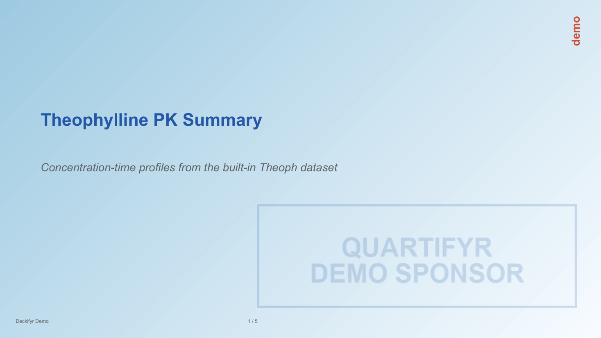

# deckifyr demo deck

A small, working example, in the spirit of
[quartifyr's `examples/demo-report`](https://github.com/jprybylski/quartifyr/tree/main/examples/demo-report):
a five-slide PK-style deck built from version-controlled YAML, using a
real `reportifyr` artifact and two real `quarto` fragments rather than
placeholder content.

> **Building this deck requires the external `quarto` binary on `PATH`**
> (<https://quarto.org>) -- the `pk-interpretation` slide's `note`
> element also executes a real R code chunk, so it needs `Rscript` too.
> Every other slide needs nothing beyond this repo's own Python
> dependencies. See `inst/examples/minimal-deck/` instead for a project
> that builds with no external tools at all.

## What it builds

Every slide also carries `design.yaml`'s `slide.background_gradient` (a
light, sequential-blue linear fill), `slide.background_image` (a faint,
brand-tinted watermark rendering of `assets/logo.png`), and, for this
build only, a diagonal "DEMO" `furniture.status` watermark (uppercased
from `metadata.status: demo`) -- see "Where the background and
watermark come from" below.

1. **Title** -- a markdown heading + italic subtitle (`layout: blank`,
   list-form elements).
2. **Concentration-Time Profile** -- a two-zone `plot-with-note` layout
   (defined in `layouts.yaml`, not `title-content`): the figure on the
   left, an interpretive note on the right, matching the `exposure-plot`
   slide shape in `deckifyr-specification.md` section 7.6's own example.
   Also carries speaker notes (`notes:`), the only slide in this deck
   that does.
3. **Elimination Half-Life** -- the same `plot-with-note` layout,
   filled with two `type: quarto` elements instead (spec section 8.1,
   [issue #3](https://github.com/jprybylski/deckifyr/issues/3)): see
   "Where the quarto fragments come from" below.
4. **Per-Participant PK Summary** -- a `table` element (`layout: blank`,
   list-form elements) rendered from `OUTPUTS/tables/pk-summary.csv` as
   a native, fully-editable PowerPoint table, exercising
   `deckifyr.resolvers.TableResolver` (spec section 9.2) and, for its
   fill/border colors, a `design.yaml` `table_styles` entry.
5. **Closing** -- a freeform (`layout: null`) slide combining text, a
   markdown note, and a rotated logo image, to exercise `z_index` and
   `rotation` together.

## Where the figure comes from

`OUTPUTS/figures/conc-time.png` and its reportifyr metadata sidecar,
`conc-time_png_metadata.json`, are copied straight from
[quartifyr's `examples/demo-report/scripts/01_analysis.R`](https://github.com/jprybylski/quartifyr/blob/main/examples/demo-report/scripts/01_analysis.R)
-- the same run that generates the concentration-time figure that
report's own `.qmd` fills via a `{rpfy}:conc-time.png` magic string. Base
R's built-in `Theoph` dataset (12 participants' theophylline serum
concentrations after a single oral dose) is the underlying data in both
places. `assets/logo.png` is likewise copied from that same demo
project's `assets/`.

**This deck resolves that figure through a real `{rpfy}:conc-time.png`
reference**, not a plain local file: `concentration-time`'s `figure`
element uses `type: reportifyr`, `value: "{rpfy}:conc-time.png"`,
resolved by `deckifyr.resolvers.ReportifyrResolver` (spec section 9)
against `OUTPUTS/figures/` and that metadata sidecar. The sidecar's
`meta_type` (`conc-time-trajectories`) and `abbreviations` (`PK`) are
looked up in this directory's own `standard_footnotes.yaml` -- a
two-entry excerpt of reportifyr's own bundled file -- to build a footer
placed beneath the figure by default
(`footer_placement: below`, `design.yaml`'s `defaults.footer_style:
footnote`). `presentation.yaml`'s `build.reportifyr.standard_footnotes`
points at that file; without it, a `{rpfy}:`-sourced element with a
footer to show fails the build with a clear error rather than silently
skipping it.

## Where the quarto fragments come from

`pk-interpretation`'s `figure` and `note` elements are both
`type: quarto`, sourced from `.qmd` files in `fragments/`, resolved by
`deckifyr.resolvers.QuartoResolver` and executed by
`deckifyr.renderers.quarto` (spec section 8.1) -- real Quarto execution,
not placeholder text:

- `fragments/elimination-equation.qmd` has no executable code, just two
  display-math blocks (the first-order elimination model and the
  half-life formula). It's placed with `render_mode: png`: Quarto
  renders it through its bundled Typst toolchain to a content-sized PDF
  page, which `deckifyr.renderers.quarto` rasterizes to PNG with
  PyMuPDF. This is the "helpful for eg equations" case from issue #3's
  own description -- `python-pptx` has no OMML equation API, so a real
  rendered equation only comes from this path, not `render_mode: native`.
- `fragments/half-life-narrative.qmd` executes a real R code chunk
  against base R's built-in `Theoph` dataset: it fits a simple
  log-linear elimination model (`lm(log(conc) ~ Time, ...)`) to each of
  the 12 participants' terminal-phase concentrations and reports the
  population mean half-life. It's placed with `render_mode: native`
  (set explicitly, not left at `auto` -- `auto` would pick `png` for any
  fragment with a code chunk, per
  `deckifyr.renderers.quarto.select_auto_render_mode`'s heuristic, but
  this chunk's own output is just a short computed sentence, better kept
  as real editable PowerPoint text than rasterized). The half-life value
  on the slide is a live computation, not a number typed into the
  YAML -- change the regression above, or the underlying R/knitr
  toolchain's numeric behavior, and the built slide's text changes with
  it. `tests/python/test_demo_deck.py`'s
  `test_demo_deck_narrative_fragment_executes_real_r_code` builds this
  deck for real and asserts on that computed text, not a mock.

## Where the table comes from

`OUTPUTS/tables/pk-summary.csv` is a per-participant summary (weight,
dose, observed peak concentration `Cmax`, and time-to-peak `Tmax`)
computed from the same base-R `Theoph` dataset as the concentration-time
figure above -- one row per participant, derived with
`max()`/`which.max()` over each participant's observed profile rather
than any PK modeling. The
`pk-summary` slide's `pk-table` element resolves it with
`deckifyr.resolvers.TableResolver` (CSV support is built in; the same
resolver also reads `.parquet`, via the optional `pyarrow` extra) into a
native, fully-editable PowerPoint table -- first row as header. Its
typography comes from `style: table-body`, a `text_styles` entry of its
own (13pt/`text`) rather than the shared `footnote` style branding/
page-number furniture and the reportifyr footer use -- bumping this
table's font size doesn't touch theirs. Its fill/border chrome (blue
header band, alternating row tint, thin gray grid lines) comes from
`table_style: pk-summary`, a `design.yaml` `table_styles` entry
exercising the deck's own brand colors (`primary`/`muted`) rather than
`python-pptx`'s bundled default table look.

## Where the background and watermark come from

`design.yaml`'s `slide.background_gradient` is a two-stop linear
gradient (spec section 7.4) -- `#F7FBFF` to `#9ECAE1` at a 135-degree
angle, ColorBrewer's published "Blues" sequential palette
(<https://colorbrewer2.org>, class 3). That's a values choice, not a
code dependency: deckifyr's Python engine doesn't gain an RColorBrewer
dependency for this (see CLAUDE.md's "one engine, two facades"
invariant) -- the two hex values are just typed into `design.yaml` like
any other color. Deliberately more saturated at the darker end than a
"barely visible" pale wash on both stops -- a very low-contrast gradient
reads as flat at slide scale, especially in a thumbnail.

`slide.background_image` points at `assets/logo-watermark.png`, a
faint, brand-tinted rendering of `assets/logo.png` (the same placeholder
logo the `closing` slide's `logo` element already uses), generated with
Pillow: near-white pixels become fully transparent, near-black pixels
become `colors.primary` at low alpha, then the result is composited
onto a transparent canvas matching the slide's own 13.333:7.5 aspect
ratio so `contain` fit (the default `image_fit`) covers the slide with
no letterboxing. Real PNG alpha transparency, not a compositor feature
-- `background_image` composes it exactly like any other image element,
with no code changes involved. Regenerate it with:

```python
from PIL import Image

logo = Image.open("assets/logo.png").convert("RGBA")
px = logo.load()
for y in range(logo.height):
    for x in range(logo.width):
        r, g, b, a = px[x, y]
        lum = (r + g + b) / 3
        if lum > 235:
            px[x, y] = (0, 0, 0, 0)
        else:
            darkness = max(0.0, min(1.0, (235 - lum) / 235))
            px[x, y] = (36, 87, 166, int(46 * darkness))  # colors.primary, ~18% alpha

logo_cropped = logo.crop(logo.getbbox())
canvas = Image.new("RGBA", (2000, 1125), (0, 0, 0, 0))
scaled = logo_cropped.resize(
    (int(logo_cropped.width * 1.8), int(logo_cropped.height * 1.8)), Image.LANCZOS
)
canvas.alpha_composite(scaled, (2000 - scaled.width - 80, 1125 - scaled.height - 100))
canvas.save("assets/logo-watermark.png")
```

Finally, `design.yaml`'s `furniture.status` (spec section 7.8) configures
two placements a build may choose between -- neither is "the" status
marker on its own:

- `watermark`: the diagonal "DEMO" mark this build actually uses.
  `rotation: -30` for the diagonal angle, and `z_index: 9999` so it
  paints *on top* of ordinary slide content instead of behind it -- the
  conventional Word/Google Docs watermark placement, and the reason this
  looks like a real watermark rather than a large diagonal label.
  Painting on top only stays legible because its own `style: watermark`
  `text_styles` entry sets `opacity: 0.28` on a saturated `color: primary`
  -- a translucent brand color, not a separately hand-mixed pale one, so
  it reads consistently whether it's crossing the plain background, the
  reportifyr figure, the native table, or the rasterized equation image.
- `corner_br` and `corner_tr`: smaller, simpler bottom-right/top-right
  labels using their own dedicated `status-corner` style (bold, `accent`
  color, 18pt -- noticeably bigger and bolder than the `footnote` style
  branding/page-number use, per issue #13: an earlier version of this
  demo reused `footnote` here and it read as too small to actually
  catch a viewer's eye), with no `z_index`/`opacity` -- alternatives
  this deck's own `presentation.yaml` could select instead
  (`status_indicator: corner-br`/`corner-tr`) but doesn't, configured
  here to show the option exists (`corner_tl`/`corner_bl` are the same
  idea, just not configured in this particular demo). Both also set
  `rotation: -90`, turning the label on its side so it reads
  bottom-to-top as a narrow vertical strip flush against the right
  margin, rather than a wide horizontal box -- but that rotation is this
  demo's own styling choice, not something `StatusIndicatorStyle`
  applies by default (every placement's `rotation` is 0, an ordinary
  upright label, unless a `design.yaml` author sets it); a left-edge
  placement would use `rotation: 90` instead, mirroring it the other
  way. Getting the label to actually sit flush in the corner (rather
  than centered along the middle of that rotated strip) additionally
  needs `Element.align` (issue #13's second ask, `deckifyr.plan`
  derives it automatically as `"right"` for these two fields, `"left"`
  for `corner_tl`/`corner_bl` -- not something set in `design.yaml`
  itself); design.yaml's own comment above the two placements has the
  fuller geometry explanation, including why `corner_br`'s box sits
  well below the slide's own height.



The screenshot above is *not* part of this deck's own tracked build --
`presentation.yaml` here sets `status_indicator: watermark`, so
`build/demo-deck.pptx` never uses `corner_tr`. It's a one-off render
from a throwaway copy of this same project with only that one line
changed, to show the alternative placement actually composed rather
than just described. Reproduce it with:

```bash
cp -r examples/demo-deck /tmp/corner-tr-demo
sed -i.bak 's/^status_indicator: watermark/status_indicator: corner-tr/' \
  /tmp/corner-tr-demo/presentation.yaml
uv run deckifyr build /tmp/corner-tr-demo/presentation.yaml
soffice --headless --convert-to pdf --outdir /tmp/corner-tr-demo \
  /tmp/corner-tr-demo/build/demo-deck.pptx
# rasterize page 1 of the PDF at 110dpi (see .githooks/pre-commit's own
# recipe for the exact PyMuPDF snippet) into
# man/figures/demo-deck-corner-tr-example.png
```

Note the lowercase "demo" in that screenshot, unlike the diagonal
watermark's all-caps "DEMO": `corner_tr` uses `style: status-corner`,
which sets no `text_transform` (unlike `style: watermark`'s own
`text_transform: uppercase`) -- each placement is free to style its
text however fits a small corner label versus a large diagonal mark.

Neither placement carries its own text or an on/off switch -- both come
from `presentation.yaml`: `status_indicator: watermark` picks which
placement to use (`corner-br`/`corner-tr`/`corner-tl`/`corner-bl`/`none`
are the other choices). The word itself comes from `metadata.status:
demo` (already set, for ordinary descriptive purposes) rather than a
separate `watermark:` field -- this deck deliberately leaves `watermark`
unset so `deckifyr.plan.expand_presentation`'s own fallback applies,
rather than typing "demo" a second time. `design.yaml`'s `watermark`
`text_styles` entry then uppercases it (`text_transform: uppercase`)
into "DEMO" -- the conventional all-caps status/watermark look --
without the author writing it that way themselves; setting
`watermark: CONFIDENTIAL` (or anything else) in `presentation.yaml`
would override that fallback with different text entirely.
`deckifyr.plan` always centers a status indicator's text, both
horizontally and vertically, within its own box -- a short label/word
(unlike flowing body text) reads correctly centered, and without it a
large rotated watermark reads distractingly off-center.

## Building it

```bash
uv run deckifyr build examples/demo-deck/presentation.yaml
```

writes `examples/demo-deck/build/demo-deck.pptx` and
`examples/demo-deck/build/demo-deck.manifest.json` (both gitignored --
regenerate rather than expect them to already be there after a clone).

From R:

```r
deck_build("examples/demo-deck/presentation.yaml")
```

## Regenerating the source figure

If you want to regenerate `conc-time.png` from scratch rather than trust
the committed copy, run quartifyr's own
`examples/demo-report/scripts/01_analysis.R` (see that repo's README)
and copy `OUTPUTS/figures/conc-time.png` (plus its `_metadata.json`
sidecar) back into this directory's `OUTPUTS/figures/`.
