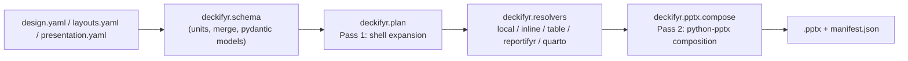

```{r, include = FALSE}
knitr::opts_chunk$set(collapse = TRUE, comment = "#>", eval = FALSE)
```

Everything deckifyr actually does -- schema validation, unit parsing,
deep-merge precedence, plan/shell expansion, and `.pptx` composition --
lives in `inst/python/deckifyr/`, a real, independently-installable
Python package -- the same source tree is bundled unmodified inside the
R package and built as a standalone wheel (where it's published is
still an open question, spec section 21). The R package is a thin
facade over it via [`pyro`](https://github.com/A2-ai/pyro), never a
second implementation of the same logic. This article covers
using it directly, with no R involved at all -- everything below also
works the same way whether it's driven by the R facade or by hand.

```bash
git clone https://github.com/jprybylski/deckifyr && cd deckifyr
uv sync --extra dev   # provisions .venv/ from pyproject.toml
uv run deckifyr --help
```

`uv run` manages its own ephemeral venv from `pyproject.toml`; no manual
venv activation is needed for any command below.

## The CLI

```bash
uv run deckifyr [--json] <command> ...
```

`--json` emits structured JSON instead of human-readable text on
success; every command's exit code is stable and independent of message
wording (`0` success, `1` schema/validation failure, `2` argparse usage
error, `3` I/O failure, `4` feature not implemented yet). No subcommand
makes network calls.

### `init`: scaffold a new project

```bash
uv run deckifyr init my-deck [--force]
```

Copies the bundled `design.yaml`/`layouts.yaml`/`presentation.yaml`
trio from `inst/examples/minimal-deck/` into `my-deck/`. Errors if the
target directory isn't empty unless `--force` is given.

### `validate`: schema + geometry validation

```bash
uv run deckifyr validate my-deck/presentation.yaml [--strict|--warn-only]
```

Loads and pydantic-validates the presentation, design, and layouts
documents together -- cross-checking layout references and box unit
strings -- without composing anything. `--strict` (the default) fails
on any problem; `--warn-only` downgrades non-fatal issues to warnings.

### `build`: compile a `.pptx`

```bash
uv run deckifyr build my-deck/presentation.yaml [--strict|--warn-only]
```

Validates the same way as `validate`, then runs the two-pass pipeline
(below) to write a real `.pptx` and a JSON manifest next to it, per
`presentation.yaml`'s `build.output`/`build.manifest` settings.

### `schema`: dump a document type's JSON Schema

```bash
uv run deckifyr schema {design,layouts,presentation}
```

Prints the pydantic model's `model_json_schema()` for the given
document type -- useful for editor autocomplete/validation on the YAML
files themselves.

### `preview`: render slide PNGs

```bash
uv run deckifyr preview my-deck/presentation.yaml [--slides 1,3]
```

Renders each slide to a standalone PNG via LibreOffice
(`soffice --headless --convert-to pdf`) + PyMuPDF rasterization --
requires `soffice` on `PATH`; fails with a structured
`E_MISSING_DEPENDENCY` error naming where to get it
(https://www.libreoffice.org/download/download/) if it isn't found.
`--slides` restricts rendering to specific 1-indexed slide numbers
(default: every slide). `presentation.yaml`'s `build.previews: true`
also renders previews as part of an ordinary `build`.

### `inspect`: look inside a presentation or a built `.pptx`

```bash
uv run deckifyr inspect my-deck/presentation.yaml
uv run deckifyr inspect my-deck/build/my-deck.pptx
```

Detects the target by file extension. Given a `presentation.yaml`, it
plans the deck (the same Pass 1 `build`/`validate` already use) and
reports the resolved slide list -- element counts/types, notes presence
-- without composing or writing anything. Given a `.pptx`, it opens the
file for real with `python-pptx` and reports what actually landed in it
(slide/shape counts, shape names, rotation, notes presence), plus a
summary of a sibling `<stem>.manifest.json` if one exists.

### `get`/`set`: read and write a single config value

```bash
uv run deckifyr get my-deck/design.yaml colors.primary
uv run deckifyr set my-deck/design.yaml colors.primary "#123456"
```

Dotted-path (`.`/`[N]`) access into any of the three document types,
e.g. `colors.primary` or `slides[0].notes`. `set`'s `value` is parsed
as JSON (numbers/bools/null/arrays/objects) when it's valid JSON,
otherwise used as a literal string -- so a bare hex color or font name
needs no quoting, while `--string` forces the literal-string branch for
a value that would otherwise parse as JSON (e.g. the literal text
`"true"`). Every edit is schema-validated (and, for a changed
`slide.layout`, cross-checked against `layouts.yaml`) *before* it's
written -- a rejected edit never touches the file.

### `slide`: manage `presentation.yaml`'s slide list

```bash
uv run deckifyr slide list my-deck/presentation.yaml
uv run deckifyr slide add my-deck/presentation.yaml --id new-slide --layout title-slide
uv run deckifyr slide update my-deck/presentation.yaml new-slide --notes "..."
uv run deckifyr slide move my-deck/presentation.yaml new-slide --after intro
uv run deckifyr slide remove my-deck/presentation.yaml new-slide
```

`list`/`add`/`update`/`move`/`remove`, id-keyed throughout -- array
indices are never the primary way to address a slide. `add`/`move`
accept at most one of `--index`/`--after`/`--before`.

### `skills`: export bundled coding-agent skill files

```bash
uv run deckifyr skills .claude/skills
```

Exports two bundled Claude Skills-format `SKILL.md` files
(`deckifyr-org-config` for `design.yaml`/`layouts.yaml`,
`deckifyr-presentation` for `presentation.yaml`) to a directory of your
choice -- works with Claude Code or any other coding agent that reads
`SKILL.md` files.

### `serve`: the local web editor

```bash
uv run deckifyr serve --project my-deck
```

Requires the optional `web` extra (`uv sync --extra web`, or
`pip install deckifyr[web]`) for `fastapi`/`uvicorn`. Runs a local
FastAPI backend plus a React/Konva editor over one project directory
for the life of the process -- drag/resize/rotate elements on a slide
canvas, edit `design`/`layouts`/`presentation.yaml` through a
schema-driven form (or raw JSON), trigger builds, and download
artifacts. See `vignette("web-app")` for the full walkthrough.

## Architecture: two decoupled passes



`deckifyr.plan` (Pass 1) has **zero** `python-pptx` import. It resolves
`design.yaml` style tokens to literal values and expands each slide's
elements -- including document furniture (background/status/branding/
page-number) and `{rpfy}:` magic-string resolution via
`deckifyr.resolvers` -- into `ResolvedElement`/`ResolvedSlide`
dataclasses: a shell that's inspectable or cacheable on its own, with no
second pass required to make sense of it. `deckifyr.pptx.compose` (Pass
2) is the only place that touches `python-pptx`, turning that shell into
real shapes on real slides. If you're extending deckifyr rather than
just using it, this split is the first thing to understand -- a new
element type's zone/required semantics belong in `plan.py`; only actual
shape construction belongs in `pptx/compose.py`.

`deckifyr.renderers.quarto` executes a `type: quarto` element's `.qmd`
fragment (via a real `quarto` binary) and turns it into either
normalized text or a rasterized PNG, resolved into the plan by
`deckifyr.resolvers.quarto.QuartoResolver` like any other element
source -- never through Quarto's own PPTX writer.
`deckifyr.renderers.preview` shells out to LibreOffice + PyMuPDF to
render slide PNGs (the `preview` command above). `deckifyr.web` is the
FastAPI backend + React/Konva frontend behind `serve` above -- it calls
straight into the same `deckifyr.plan`/`deckifyr.pptx.compose`/
`deckifyr.editor` pipeline this section describes, not a second
implementation of it.

## Optional extras

```bash
uv pip install 'deckifyr[tables]'   # Parquet table sources (pyarrow)
uv pip install 'deckifyr[web]'      # the `serve` command's web editor
uv pip install 'deckifyr[dev]'      # test suite (pytest, pyarrow)
```

CSV table sources work with no extra; a project using only CSV
`table` elements never pays for `pyarrow`.

## Tests

```bash
uv run --extra dev pytest tests/python -v
```

Unit-level coverage of units/merge/schema loading/CLI exit codes/plan
expansion/PPTX composition, plus `test_demo_deck.py`, an end-to-end
build of `examples/demo-deck/` (see [Examples](examples.html)).
