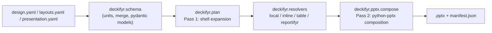

```{r, include = FALSE}
knitr::opts_chunk$set(collapse = TRUE, comment = "#>", eval = FALSE)
```

Everything deckifyr actually does -- schema validation, unit parsing,
deep-merge precedence, plan/shell expansion, and `.pptx` composition --
lives in `inst/python/deckifyr/`, a real, independently-installable
Python package -- the same source tree is bundled unmodified inside the
R package and built as a standalone wheel (where it's published is
still an open question, spec section 21). The R package is a thin
facade over it via [`pyro`](https://github.com/A2-ai/pyro), never a
second implementation of the same logic. This article covers
using it directly, with no R involved at all -- everything below also
works the same way whether it's driven by the R facade or by hand.

```bash
git clone https://github.com/jprybylski/deckifyr && cd deckifyr
uv sync --extra dev   # provisions .venv/ from pyproject.toml
uv run deckifyr --help
```

`uv run` manages its own ephemeral venv from `pyproject.toml`; no manual
venv activation is needed for any command below.

## The CLI

```bash
uv run deckifyr [--json] <command> ...
```

`--json` emits structured JSON instead of human-readable text on
success; every command's exit code is stable and independent of message
wording (`0` success, `1` schema/validation failure, `2` argparse usage
error, `3` I/O failure, `4` feature not implemented yet). No subcommand
makes network calls.

### `init`: scaffold a new project

```bash
uv run deckifyr init my-deck [--force]
```

Copies the bundled `design.yaml`/`layouts.yaml`/`presentation.yaml`
trio from `inst/examples/minimal-deck/` into `my-deck/`. Errors if the
target directory isn't empty unless `--force` is given.

### `validate`: schema + geometry validation

```bash
uv run deckifyr validate my-deck/presentation.yaml [--strict|--warn-only]
```

Loads and pydantic-validates the presentation, design, and layouts
documents together -- cross-checking layout references and box unit
strings -- without composing anything. `--strict` (the default) fails
on any problem; `--warn-only` downgrades non-fatal issues to warnings.

### `build`: compile a `.pptx`

```bash
uv run deckifyr build my-deck/presentation.yaml [--strict|--warn-only]
```

Validates the same way as `validate`, then runs the two-pass pipeline
(below) to write a real `.pptx` and a JSON manifest next to it, per
`presentation.yaml`'s `build.output`/`build.manifest` settings.

### `schema`: dump a document type's JSON Schema

```bash
uv run deckifyr schema {design,layouts,presentation}
```

Prints the pydantic model's `model_json_schema()` for the given
document type -- useful for editor autocomplete/validation on the YAML
files themselves.

### Not implemented yet

`preview`, `inspect`, and `serve` all parse their arguments fully but
raise `NotImplementedFeatureError` (exit code `4`) rather than silently
doing nothing -- the slide-preview renderer, the `.pptx`/presentation
inspector, and the local web application are later-phase work (see
`deckifyr-specification.md` section 18).

## Architecture: two decoupled passes



`deckifyr.plan` (Pass 1) has **zero** `python-pptx` import. It resolves
`design.yaml` style tokens to literal values and expands each slide's
elements -- including document furniture (background/status/branding/
page-number) and `{rpfy}:` magic-string resolution via
`deckifyr.resolvers` -- into `ResolvedElement`/`ResolvedSlide`
dataclasses: a shell that's inspectable or cacheable on its own, with no
second pass required to make sense of it. `deckifyr.pptx.compose` (Pass
2) is the only place that touches `python-pptx`, turning that shell into
real shapes on real slides. If you're extending deckifyr rather than
just using it, this split is the first thing to understand -- a new
element type's zone/required semantics belong in `plan.py`; only actual
shape construction belongs in `pptx/compose.py`.

`deckifyr.renderers` (Quarto integration) and `deckifyr.web` (the local
web app) are intentionally empty packages today -- later phases, not
gaps in the pipeline above.

## Optional extras

```bash
uv pip install 'deckifyr[tables]'   # Parquet table sources (pyarrow)
uv pip install 'deckifyr[web]'      # reserved for the Phase 3 web app
uv pip install 'deckifyr[dev]'      # test suite (pytest, pyarrow)
```

CSV table sources work with no extra; a project using only CSV
`table` elements never pays for `pyarrow`.

## Tests

```bash
uv run --extra dev pytest tests/python -v
```

Unit-level coverage of units/merge/schema loading/CLI exit codes/plan
expansion/PPTX composition, plus `test_demo_deck.py`, an end-to-end
build of `examples/demo-deck/` (see [Examples](examples.html)).
